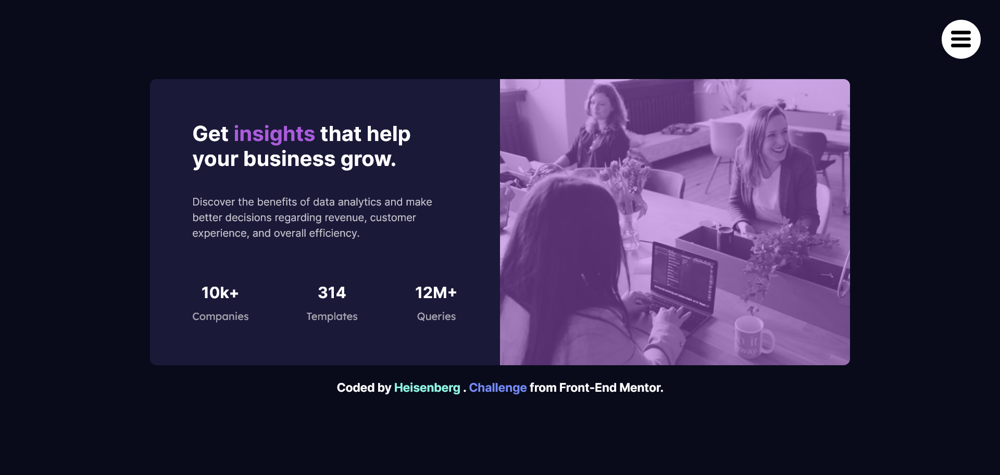

# Frontend Mentor - Stats preview card component solution

This is a solution to the [Stats preview card component challenge on Frontend Mentor](https://www.frontendmentor.io/challenges/stats-preview-card-component-8JqbgoU62). I did it all by myself and had a lot of fun doing it! Also I made a nice modern hamburger menu😎

## Table of contents

- [Overview](#overview)
  - [The challenge](#the-challenge)
  - [Screenshot](#screenshot)
  - [Links](#links)
- [My process](#my-process)
  - [Built with](#built-with)
  - [What I learned](#what-i-learned)
  - [Continued development](#continued-development)
  - [Useful resources](#useful-resources)
- [Author](#author)
- [Acknowledgments](#acknowledgments)

## Overview

It was nice great challenge and I also tried to make a modern hamburger menu and I hope you like it!

### The challenge

Users should be able to:

- View the optimal layout depending on their device's screen size

### Screenshot

### Links

- Solution URL: (https://www.frontendmentor.io/solutions/stats-component-card-using-html-css-sass-and-a-little-bit-of-talent-puX56oKHbS)
- Live Site URL: ((https://mckh03.github.io/FEM-Stats-Preview-Card-Component/)

## My process

### Built with

- Semantic HTML5 markup
- CSS custom properties
- Flexbox
- Desktop-first workflow
- Sass
- SCSS

### What I learned

There were many things that I learned during coding this little project specially when I was trying to build my little hamburger menu.

Also I learned some great tricks using background-images such as using padding-top or padding-bottom instead of height of these kind of images.

I also used my new learned skill SASS to implement this mini project and I guess I did a good job actually😅

I hope you enjoy the overall look of what I built!

### Continued development

I think I'm gonna build more menus like the one I built in this one because I learned a lot building it on my own and use more modern effects in them. Also at this time, I'm also learning JavaScript and in the future I will use JS in my projects too!

## Author

- Frontend Mentor - [@MCKH03](https://www.frontendmentor.io/profile/MCKH03)
- Twitter - [@ytmehrshad](https://twitter.com/ytmehrshad)
- GitHub - (https://github.com/MCKH03)
- LinkedIn - (https://www.linkedin.com/in/mehrshad-khavari-581937276/)
